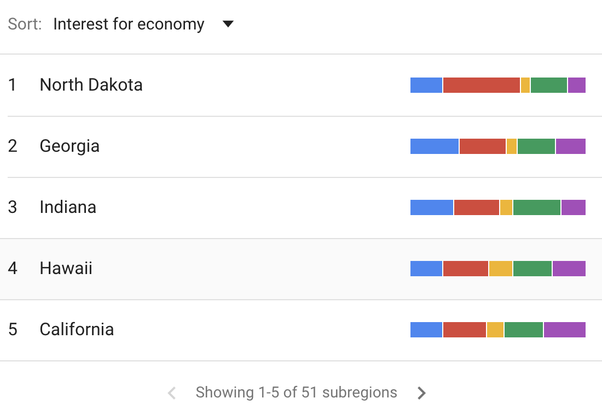
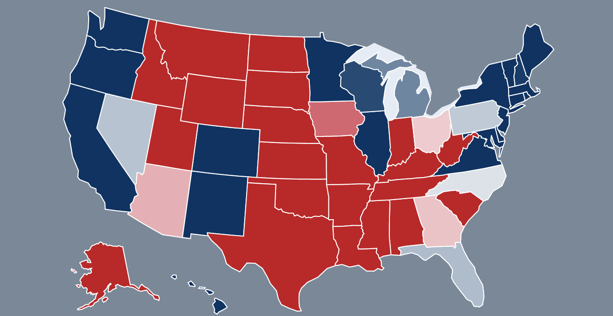

# Election Forecasting with Google Trends

### Introduction
The idea for this project came from a book I read called [Everybody Lies by Seth Stephens-Davidowitz](http://sethsd.com/everybodylies) which identifies statewide Google Search Trends as possible indicators of voting behavior. I was enthralled by this idea and sought to apply it as a correction for polling data in election forecasting models. 

### Methodology
The weakness of Google Search Trend data is that it does not inherently indicate the political leanings of the user, with the exception of some heavily polarizing and infrequently used language. The theory, which I have borrowed from my favorite television show The West Wing (Season 7, Episode 2 to be precise), is that typical Democratic and Republican candidates will focus their platforms on different issues than their opponent.

<strong>Google Trends Proportions</strong>

I used this theory to compare relative search term frequency with Google Trends for each state and build a classification model trained on Google Trends data and tested on past voting behavior. Basically, how do X-party states search political topics vs. how do Y-party states search political topics.

Additionally, polling data is weighted by recency and its [FiveThirtyEight Pollster Rankings](https://projects.fivethirtyeight.com/pollster-ratings/). FiveThirtyEight's Election Forecast model in the 2016 Presidential Election was widely regarded as more accurate than most in allowing for a greater probability of Trump winning the election and I wanted to include their idea of assigning ratings based on the methodology and prediction accuracy of polling institutions.

As I originally intended Google Trends results to be a correction and not a significant predictor, I examined the average polling accuracy as posted by FiveThirtyEight and settled on a 5% "correction" term for Google Trends with the polls still retaining 95% of the weight.

<strong>FiveThirtyEight Poll Accuracy</strong>

### Workflow
1. EDA
2. Analysis of Past Voting Data
3. Collection of Google Trends Data
   - Gather 2016 data
   - Build 2016 model to identify best hyperparameters
   - Gather data for the past year
   - Train a model with the best hyperparameters
4. Weighting Polls by Recency and Pollster Rating
5. Visuzalizing Election Results
6. Election Forecasting

### Findings
The model trained on 2016 Google Trends data alone had an 89% training score and a 92% testing score when predicting how a state would vote in the 2016 General Presidential Election. 

The best parameters for this model were utilized to build the model that would examine current trends. Probabilities of going for the Republican/Democratic candidate are returned and added to the simulation for the candidate.

<strong>Election Forecast Output</strong>

### Data Overview

This project utilizes conventional polling techniques as a measure of prediction for electoral success while acknowledging the common failures of electoral polling that were highlighted in 2016 by including regional/statewide Google Search Trends as indicators of political sentiment.

#### FiveThirtyEight
Polling data was collected from [FiveThirtyEight](https://projects.fivethirtyeight.com/polls/) and weighted with [FiveThirtyEight's Pollster Rankings](https://projects.fivethirtyeight.com/pollster-ratings/). Collected polls examine front-runners for the Democratic Party nomination against the President and contain the candidate percentages and sample size for each poll. 

#### Ballotpedia and Harvard Database
Statewide voting trends were particularly helpful in training the Google Trends Classification model. Historic voting trends were used to identify states that:
- haven't deviated in the laste several rounds of Presidential Elections
- frequently vote together

The model will improve as more polling data is collected over the course of the Democratic Primaries and General Presidential Election. This data was collected from [Ballotpedia](https://ballotpedia.org/Presidential_election_accuracy_data) and the [Harvard Database](https://dataverse.harvard.edu/dataset.xhtml?persistentId=doi:10.7910/DVN/42MVDX).

#### Google Trends
Google Trends allows users to select up to five search terms for analysis and returns the proportion or popularity of each term in relation to the others. The selected terms were influenced by the top search terms by county found in the following Google Trends Stories on the [Democratic Primaries](https://trends.google.com/trends/story/US_cu_o_FMW2oBAACFKM_en) and [Republican Primaries](https://trends.google.com/trends/story/US_cu_jDnKdWsBAAAtzM_en).

<strong>Google Trends Results</strong>

#### General Mills Pytrends
I was unable to find an Official Google Trends API for use with Python, however I did find [General Mills Python Google Trends API](https://github.com/GeneralMills/pytrends) which allowed me to query Google Trend data on a statewide level as it has evolved over the past year. The code in this repository uses a sleep time between requests of sixty seconds so as to not go over the rate limit for the website.

### Risks and Assumptions

An issue specific to polling data is that there is no electoral fraud and that reported polling perfectly reflects the preferences of voters of the state.

The Google Trend data will assume that searches for certain political terms will have different proportions for states with leanings toward X party over Y party. This is used to gauge the likelihood that a specific state will break for X party's candidate.

#### Limitations
In states that have consistently voted for a candidate of one party over the last seven election cycles, the model recognizes as "predetermined" and will award the electoral votes to the candidate of the party with which they typically vote. This is not to say that the states will vote similarly in the next election cycle, but these states were less likely to have available polling data by reputable organizations and are assumed to stay consistent.

There are states that have not voted consistently in the past seven election cycles, yet still have no polling data. These states typically follow the same trends as "predetermined" states and are considered predetermined until polling data for that state is collected. Again, this is meant to give the most likely scenario for how a state will vote until more information can be collected.

The model will continue to improve as more polls are released and focus on the relationship between the eventual Democratic nominee and the President.

### Data Sources

Pollster Rankings:
- [FiveThirtyEight's Pollster Rankings](https://projects.fivethirtyeight.com/pollster-ratings/)

Presidential Election Polls:
- [FiveThirtyEight Polls: Presidential](https://projects.fivethirtyeight.com/polls/president-general/)

Google Trends:
- [Google Trends Home Page](https://trends.google.com/trends/?geo=US)

Google Trends Unofficial API:
- [General Mills Python Google Trends API](https://github.com/GeneralMills/pytrends)

Historic Voting Trends 1976-2016:
- [Harvard Database](https://dataverse.harvard.edu/dataset.xhtml?persistentId=doi:10.7910/DVN/42MVDX)

Ballotpedia:
- [Ballotpedia Presidential Election Accuracy](https://ballotpedia.org/Presidential_election_accuracy_data)